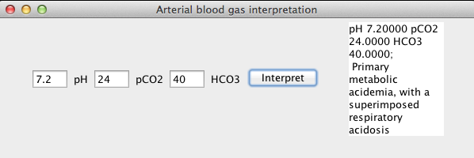

# abg-clojure

Clojure app that just calls the arterial blood gas logic found in the Android app.

## License

Copyright © 2013 Keith Flower

Distributed under the Eclipse Public License, the same as Clojure.
