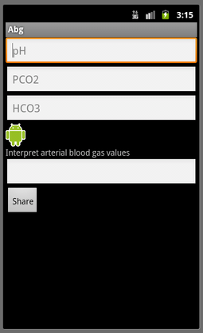

Arterial blood gas interpretation for Android
=============================================

Interpets pH, HC03, pCO2 as acidemia, alkalemia, chronic, compensated, etc., based largely on criteria in Marino's "ICU Book". Can share results via text message, email, or other installed messaging.

For Android 2.2+ platform.

